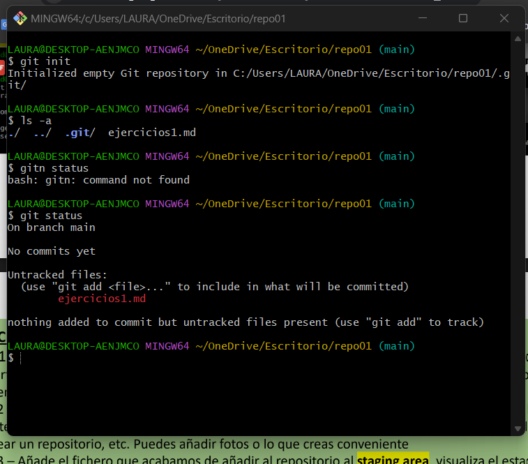

# EJERCICIOS GIT   (1)
### Ejercicio 1
#### Primeramente, he creado un directorio en mi escritorio, luego, he hecho click derecho, abrir en bash y seguidamente he puesto la informacion proporcionada en la captura.

