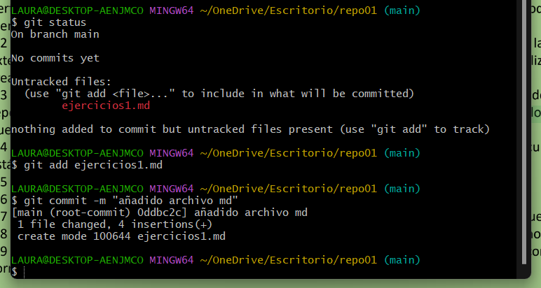
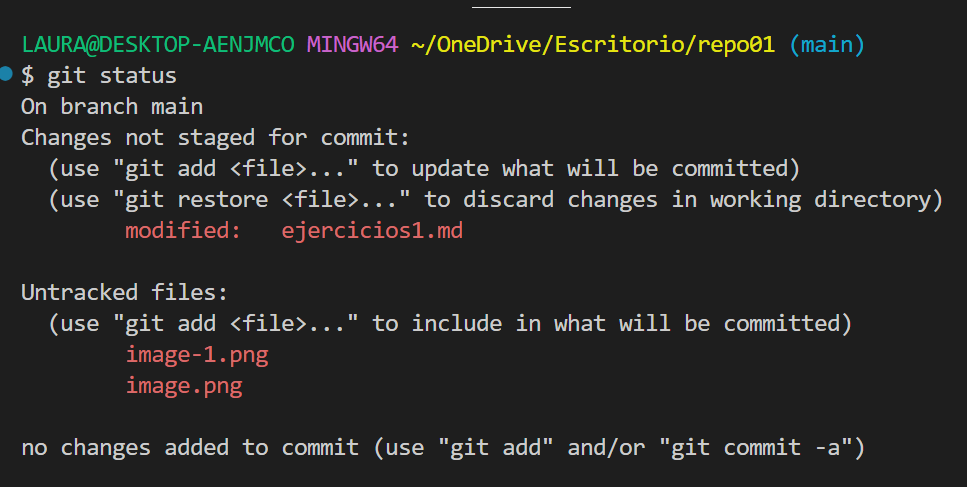

# EJERCICIOS GIT   (1)
### Ejercicio 1
#### Primeramente, he creado un directorio en mi escritorio, luego, he hecho click derecho, abrir en bash y seguidamente he puesto la informacion proporcionada en la captura.
  

### Ejercicio 2  
#### He creado el archivo en vs code y posteriormente, en la ventana de bash he usado los comandos para añadir este archivo .md al repositorio y para hacer un commit.

  

### Ejercicio 3  
#### Primero he hecho un git status, seguidamente un git add ejercicios1.md y luego he vuelto a hacer un git status.

  

### Ejercicio 4
#### 
